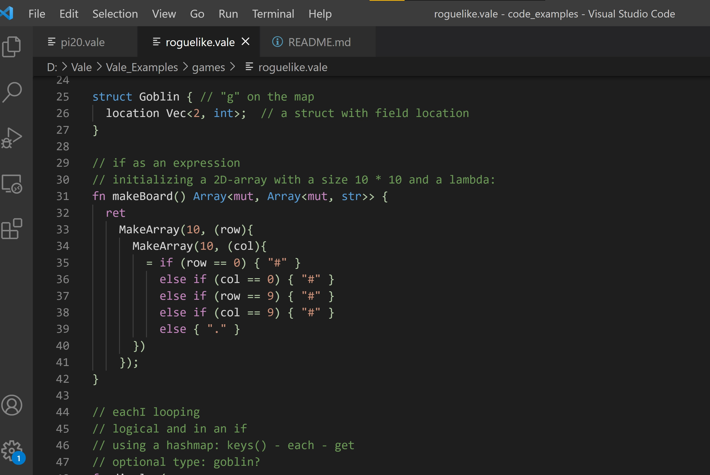

# Vale-lang README

This is a vscode extension to support developing in the [Vale Programming Language](https://vale.dev).

## Instructions
Download and unzip. Copy the entire folder into .vscode/extensions within your user folder (/home/username or c:\users\username, not your workspace folder). This will enable syntax highlighting next time VSCode is run.

Use this plugin to explore the [Vale examples](https://github.com/Ivo-Balbaert/Vale_Examples)!

## Features

Syntax Highlighting for `.vale` files

v 0.1.0  comments + basic color

v 0.1.1  more colors 

